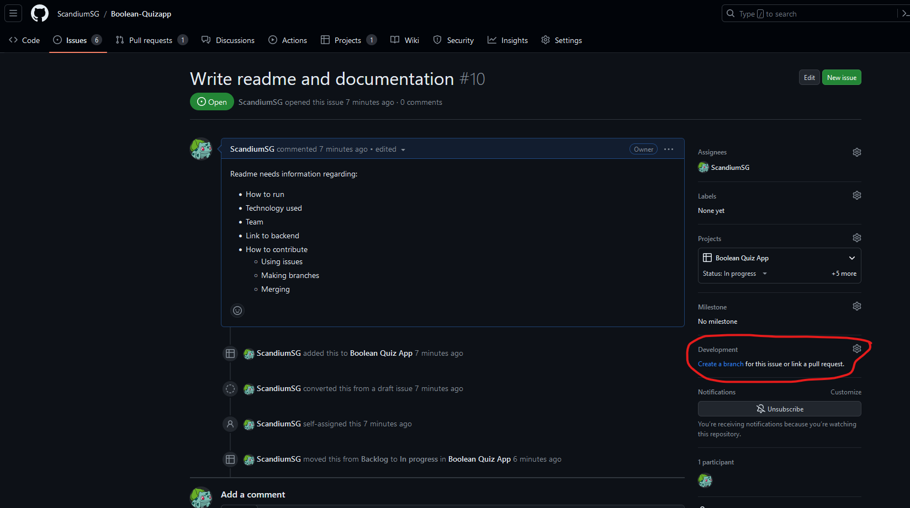
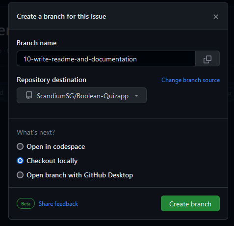
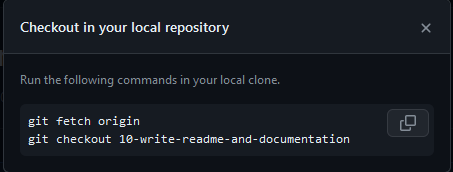

# Making branches from issues

Github provides functionality to make a issue into its own branch. 
This is done by navigating to the specific issue, and finding the Development option on the left side, as shown in the image below:

After clicking the `Create a branch` link a new component is shown, illustrated below. Do not alter the `Branch name` or the `Repository destination`, select the desired place to work with the issue (codespace, locally, or imported with Github Desktop), then press `Create branch`.

After creating the new branch it will either auto open, or the user will be presented with Git commands to generate and move to the new branch. The commands, as shown below, are simply entered into the local Git Bash terminal of the user.

After these commands have been executed you are ready to progress on the issue!